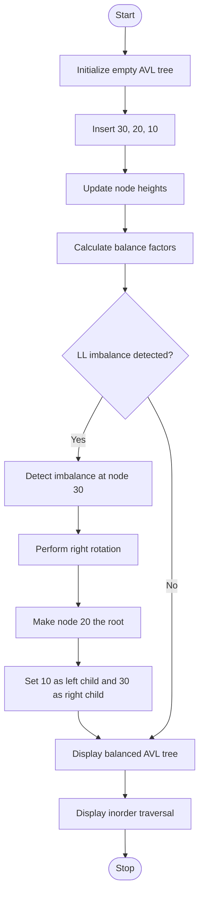

## Flowchart

```mermaid
flowchart TD
    A([Start]) --> B[Initialize empty AVL tree]
    B --> C[Insert 30, 20, 10]
    C --> D[Update node heights]
    D --> E[Calculate balance factors]
    E --> F{LL imbalance detected?}
    F -- Yes --> G[Detect imbalance at node 30]
    G --> H[Perform right rotation]
    H --> I[Make node 20 the root]
    I --> J[Set 10 as left child and 30 as right child]
    J --> K[Display balanced AVL tree]
    F -- No --> K
    K --> L[Display inorder traversal]
    L --> M([Stop])
```
