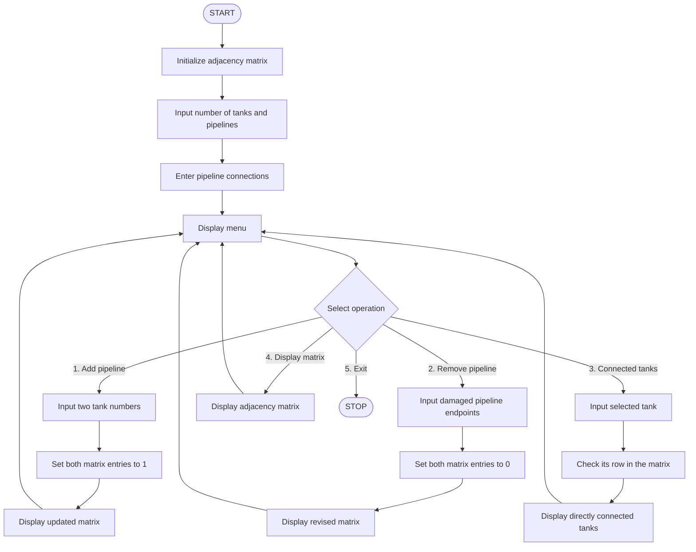

# Flowchart

```mermaid
flowchart TD
    A([START]) --> B["Initialize adjacency matrix"]
    B --> C["Input number of tanks and pipelines"]
    C --> D["Enter pipeline connections"]
    D --> E["Display menu"]
    E --> F{"Select operation"}

    F -->|1. Add pipeline| G["Input two tank numbers"]
    G --> H["Set both matrix entries to 1"]
    H --> I["Display updated matrix"]
    I --> E

    F -->|2. Remove pipeline| J["Input damaged pipeline endpoints"]
    J --> K["Set both matrix entries to 0"]
    K --> L["Display revised matrix"]
    L --> E

    F -->|3. Connected tanks| M["Input selected tank"]
    M --> N["Check its row in the matrix"]
    N --> O["Display directly connected tanks"]
    O --> E

    F -->|4. Display matrix| P["Display adjacency matrix"]
    P --> E

    F -->|5. Exit| Q([STOP])
```
