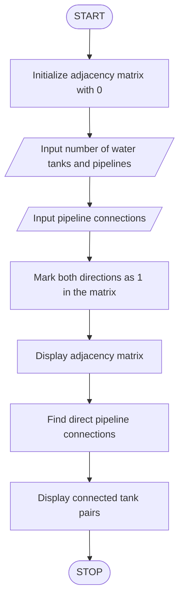

```mermaid
flowchart TD
    A([START]) --> B["Initialize adjacency matrix with 0"]
    B --> C[/Input number of water tanks and pipelines/]
    C --> D[/Input pipeline connections/]
    D --> E["Mark both directions as 1 in the matrix"]
    E --> F["Display adjacency matrix"]
    F --> G["Find direct pipeline connections"]
    G --> H["Display connected tank pairs"]
    H --> I([STOP])
```
